# 宿舍管理系统

不管你是想要学习javaweb或者是完成课程设计,这个项目都值得你一看 

+ 可以运行!!!
+ 易于改成自己的项目
+ 所用技术栈简单
+ 相比其余仅有个项目没有说明的同类项目,有较多的文档
+ 接上,所以容易写课程设计报告,或者是学习后产出博客

## 目录

<!-- vim-markdown-toc GFM -->

* [项目介绍](#项目介绍)
* [快速使用](#快速使用)
* [TODO](#todo)
* [提前预览](#提前预览)
    * [项目结构](#项目结构)
    * [部分页面显示](#部分页面显示)
    * [数据库](#数据库)

<!-- vim-markdown-toc -->

## 项目介绍
所用技术栈
+ 简单javaweb知识
+ bootstrap(用于美化)
+ mysql数据库

作者开发环境
> mysql  Ver 8.0.26 for Linux on x86_64
Tomcat 9.0.53
java11

## 快速使用
克隆当前项目并把项目中的数据库文件导入你的数据库即可
(数据库文件在database中,dormsys.sql为建表语句,dormsys_insert.sql为插入数据语句)

## TODO
本项目因开发匆忙,所以没有完成更多,以下是可以完善的点
+ 插入删除等功能,在成功操作后提示成功再返回到原有页面 
+ 修改等功能,在操作前没有判断该数据是否存在
+ 在inter中,中的接口还可以增加一个接口的接口减少冗余和规范
+ 进一步的美化
+ 更详细的注释

## 提前预览

### 项目结构
+ 代码结构
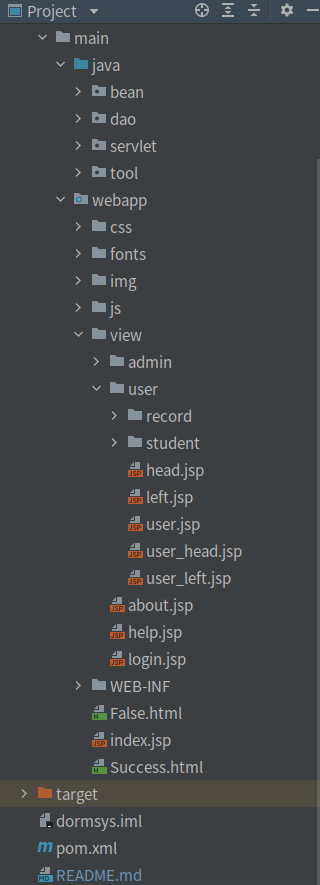 

+ 系统结构
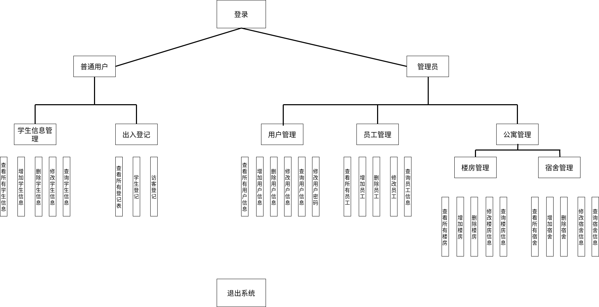 

### 部分页面显示
+ 登录界面
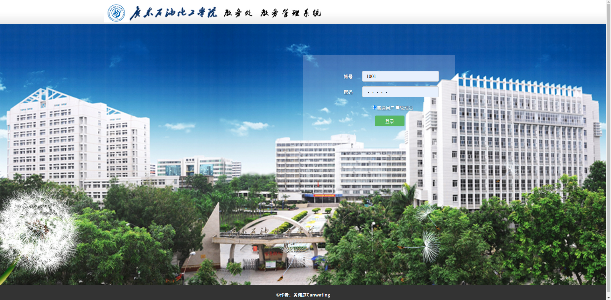 

+ 管理员首页
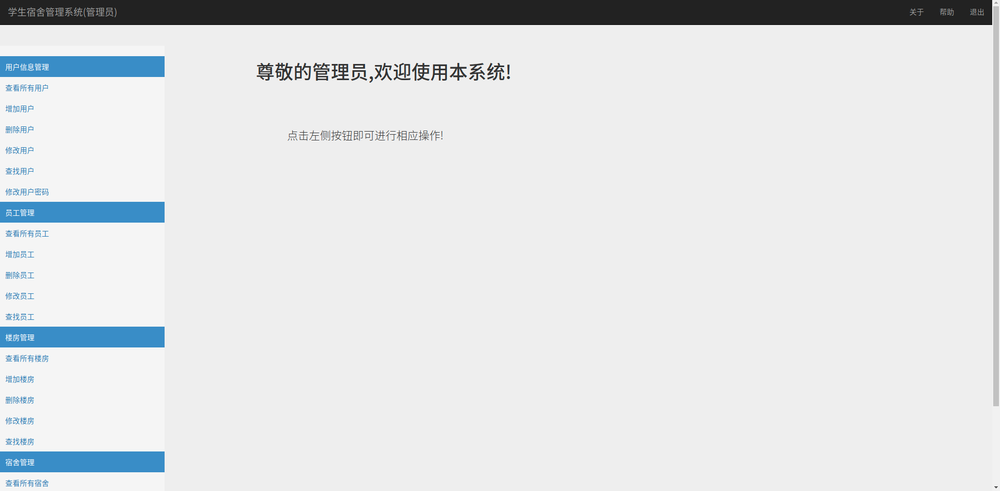 

+ 普通用户首页
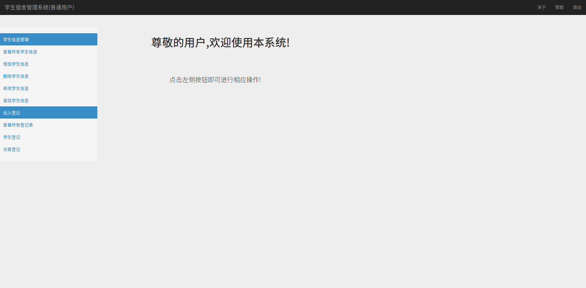 

+ 查看所有学生信息
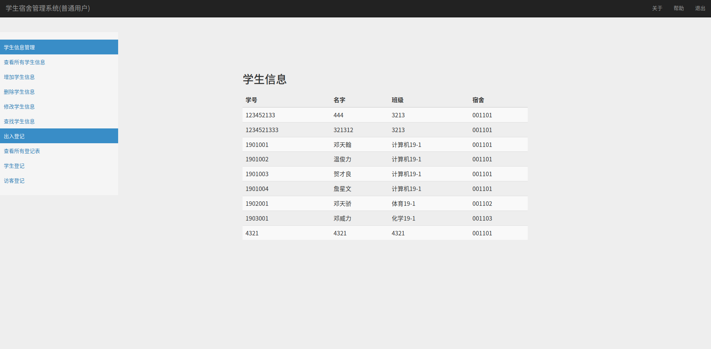 

+ 增加学生信息
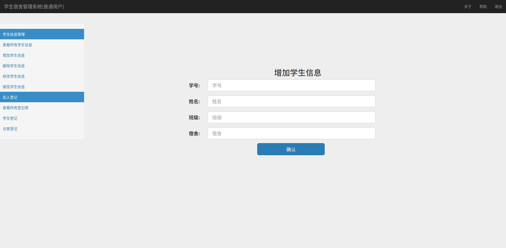 

+ 查询学生信息
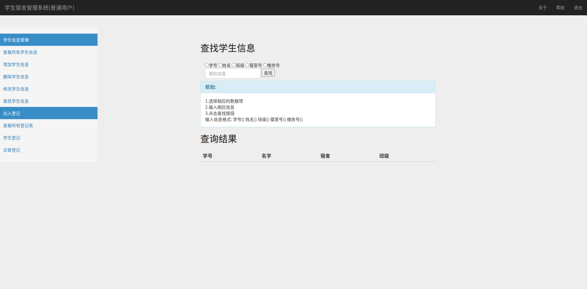 

### 数据库 
+ E-R联系图
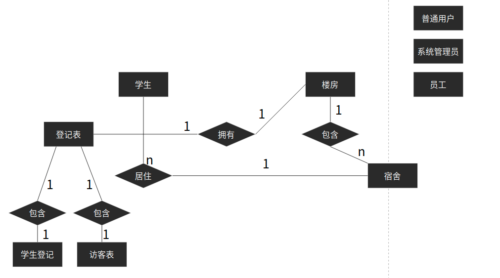 

+ E-R实体
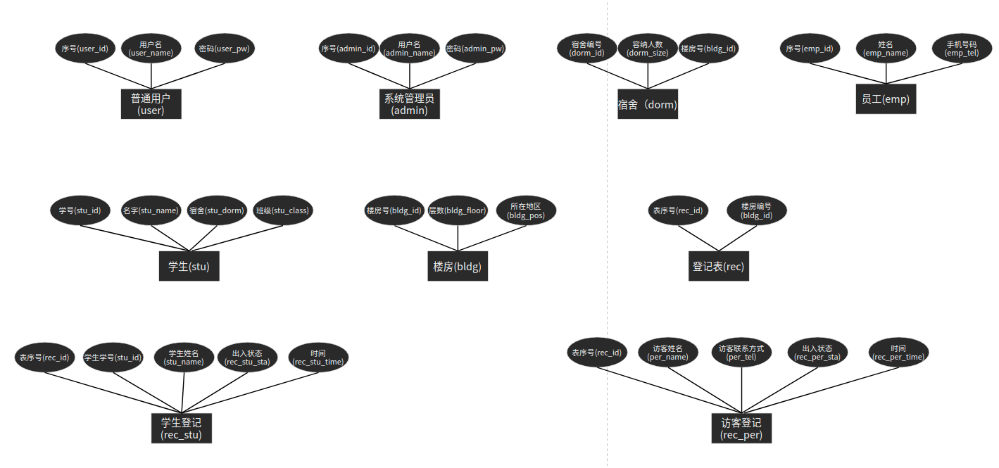 

+ 数据库建表(部分)
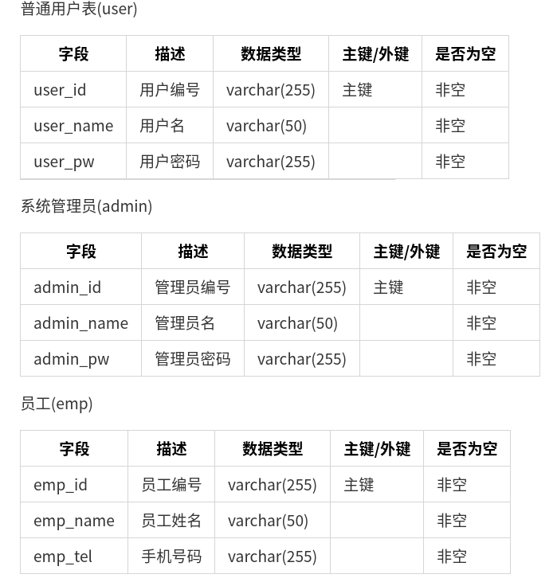 

